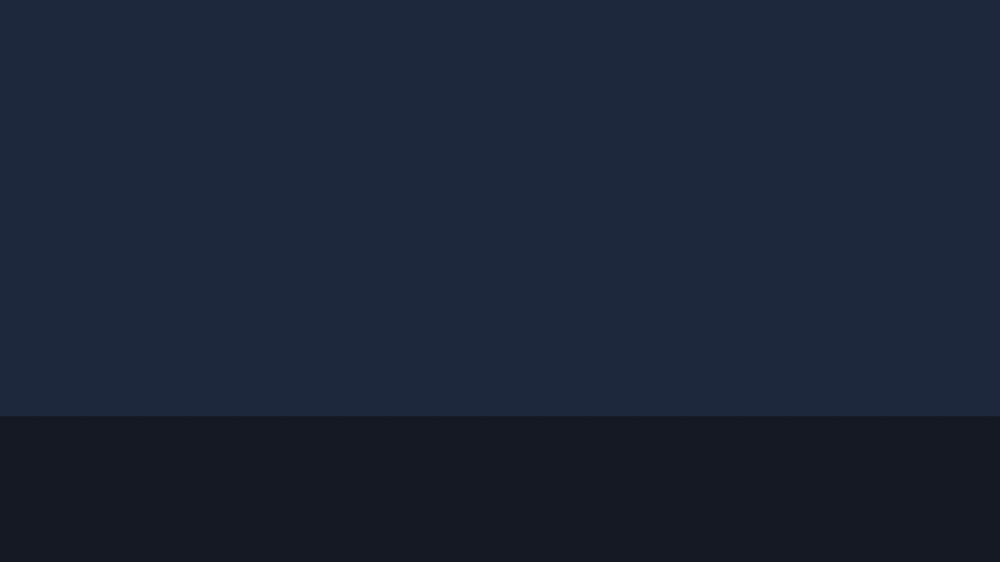

# confwall

A slideshow of upcoming CS conference paper deadlines, meant to be left running full-screen on a spare monitor or a Pi in the lab. Each slide shows one deadline over a photo of the city the conference is in.



Deadlines come from [CCF-Deadlines](https://github.com/ccfddl/ccf-deadlines) and are filtered to the next four months. Venues are grouped into software systems, HCI, machine learning, bioinformatics, computational biology, optimization, and computational neuroscience — either from `config.yml` or, for anything not listed there, from the upstream category tags. Times are shown in Pacific, with the original timezone kept as a note on the slide.

Runs on macOS, Linux, and Windows. Needs Python 3.12.

## Install

```bash
uv venv --python 3.12 .venv
source .venv/bin/activate  # .\.venv\Scripts\Activate.ps1 on Windows
uv pip install -e ".[dev]"
```

## Pexels key

City photos come from Pexels, so you need a free API key from https://www.pexels.com/api/. Put it in a `.env` file next to `config.yml`:

```
PEXELS_API_KEY=your_key_here
```

or export it as `PEXELS_API_KEY` in your shell. It's only ever read from the environment — it doesn't get written into the config, the logs, or the generated site.

## Config

```bash
cp config.example.yml config.yml
```

The example file lists every venue I care about; trim it to taste. The top-level knobs:

```yaml
window_months: 4 # how far ahead to look
slide_seconds: 15 # time per slide
display_timezone: PST
auto_discover: true # classify unlisted venues from upstream categories
venues:
    osdi:
        aliases: [OSDI]
        primary_focus: Software Systems
```

## Running

```bash
confwall run --host 0.0.0.0 --port 8000
```

That fetches fresh data, builds the static site into `build/`, and serves it. If you'd rather split the two steps, `confwall refresh` just rebuilds and `confwall serve --directory build` just serves. Both `run` and `refresh` take `--refresh-photos` to bypass the photo cache (`data/photo_manifest.json`) and `--verbose`.

The build is written to a temp directory and swapped in at the end, so if a refresh fails halfway the old slideshow keeps running.

## Viewing it

Open http://127.0.0.1:8000 and press `f` for fullscreen. Arrow keys move between slides, space pauses, and clicking anywhere advances.

For a dedicated display, skip the browser chrome entirely:

```bash
chromium-browser --kiosk --noerrdialogs --disable-infobars http://127.0.0.1:8000
```

```cmd
start msedge --kiosk http://127.0.0.1:8000 --edge-kiosk-type=fullscreen
```

## Photo overrides

Pexels sometimes returns something unrecognizable for a city. Pin a better one in `photo_overrides.yml`, keyed by `city|country`:

```yaml
photos:
    "las vegas|usa":
        pexels_id: 12345678
    "hamburg|germany":
        file: local_photos/hamburg.jpg
        credit: "Photo by Lab Member"
```

## Tests

```bash
uv run ruff check .
uv run pytest -m "not live" --cov=confwall --cov-report=term-missing
uv run pytest -m live  # hits the network
```

## Keeping it up to date

On Linux, a systemd unit for the server:

```ini
[Unit]
Description=Confwall Slideshow HTTP Server
After=network.target

[Service]
Type=simple
User=pi
WorkingDirectory=/home/pi/confwall
ExecStart=/home/pi/confwall/.venv/bin/confwall serve --host 0.0.0.0 --port 8000
Restart=always

[Install]
WantedBy=multi-user.target
```

On Windows, a scheduled task that refreshes twice a day:

```powershell
schtasks /Create /TN "ConfwallRefresh" /TR "C:\path\to\confwall\.venv\Scripts\confwall.exe refresh" /SC DAILY /ST 00:00 /RI 720 /DU 24:00
```

## Credits

Deadline data from [CCF-Deadlines](https://github.com/ccfddl/ccf-deadlines). Photos from [Pexels](https://www.pexels.com), photographer credited on each slide. MIT licensed.
